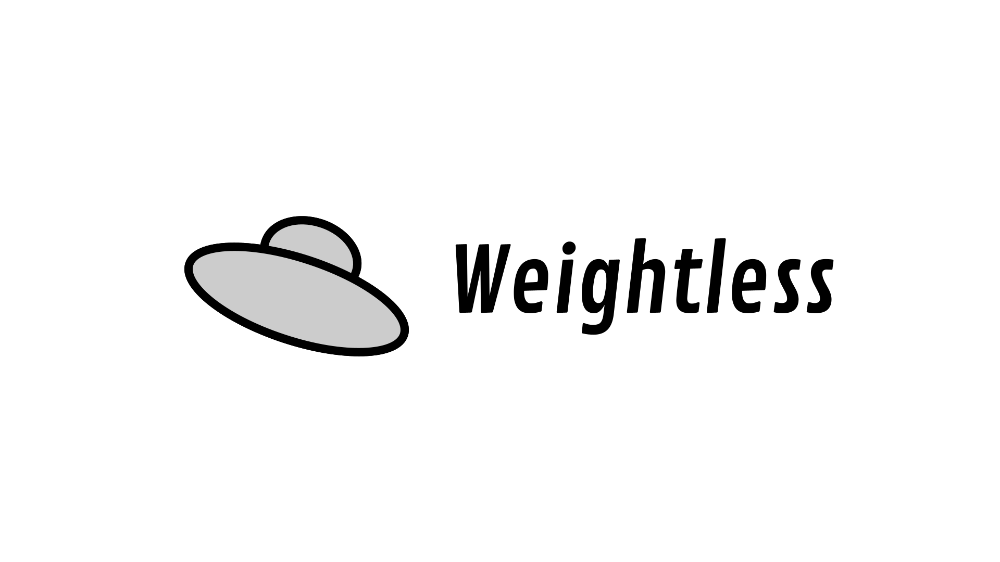

<p align="center">

</p>

Weightless is the lowest barrier-to-entry database mapping library for the JVM. Weightless currently supports [MongoDB](https://www.mongodb.com). Learn more at [weightlessorm.com](https://weightlessorm.com).

[](https://github.com/jackhallam/weightless-orm)
[](https://search.maven.org/artifact/com.jackhallam/weightless-orm/0.1.0-beta/jar)
[](https://travis-ci.com/jackhallam/weightless-orm)
[](https://app.codacy.com/gh/jackhallam/weightless-orm?utm_source=github.com&utm_medium=referral&utm_content=jackhallam/weightless-orm&utm_campaign=Badge_Grade)
[](https://www.codefactor.io/repository/github/jackhallam/weightless-orm)
[](https://lgtm.com/projects/g/jackhallam/weightless-orm)
[](https://codecov.io/gh/jackhallam/weightless-orm)
[](https://gitter.im/weightless-orm/weightless-orm)

## Getting Started
Suppose we have a `Person` object we want to store in a Mongo database.
```java
class Person {
  String name;
  int age;
}
```
With the Weightless library, the next class we will create is a `PersonAccess` interface. Note the method level and parameter level annotations.
```java
interface PersonAccess {
  @Create
  void create(Person person);
  
  @Find
  Person findByName(@Field("name") @Equals String name);
}
```
Wait! We never have to implement this interface! Weightless has enough information to implement this class for us at runtime.
```java
Weightless weightless = Weightless.mongo("mongodb://localhost:27017").database("mydatabase").build(); // Connect to a local MongoDB instance
PersonAccess personAccess = weightless.get(PersonAccess.class); // PersonAccess is implemented for us here

Person james = new Person("James", 30);
personAccess.create(james);

personAccess.findByName("James"); // { "name": "James", "age": 30 }
```

## Installation
Install with [maven](https://search.maven.org/artifact/com.jackhallam/weightless-orm/0.1.0-beta/jar):
```xml
<dependency>
  <groupId>com.jackhallam</groupId>
  <artifactId>weightless-orm</artifactId>
  <version>0.1.1-beta</version>
</dependency>
```

## Is Weightless for Me?
Is Weightless a good fit for your project? Weightless is designed to help projects get connected to a database as quickly as possible. Weightless is highly opinionated; it gives developers fewer customization options, and in return it is extremely easy to use.

That being said, Weightless does not lock you in. Off-boarding when your project is mature enough to need a highly customized solution is very simple. You can still use the same database, and you can move one database table or collection away from Weightless' control at a time as needed.

## Going Further
Visit [weightlessorm.com](https://weightlessorm.com) for a more information with live examples.
